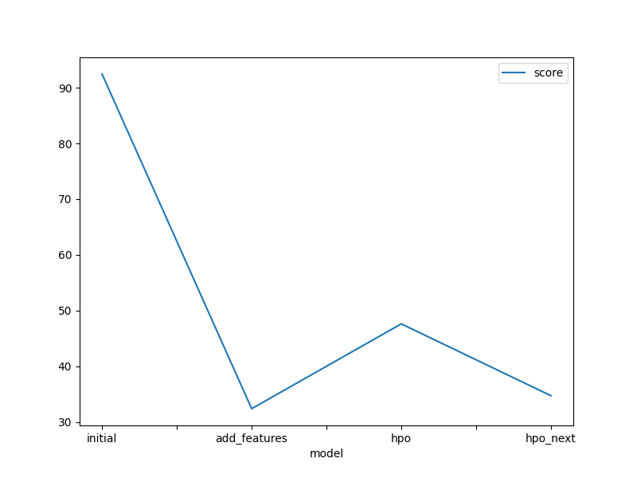
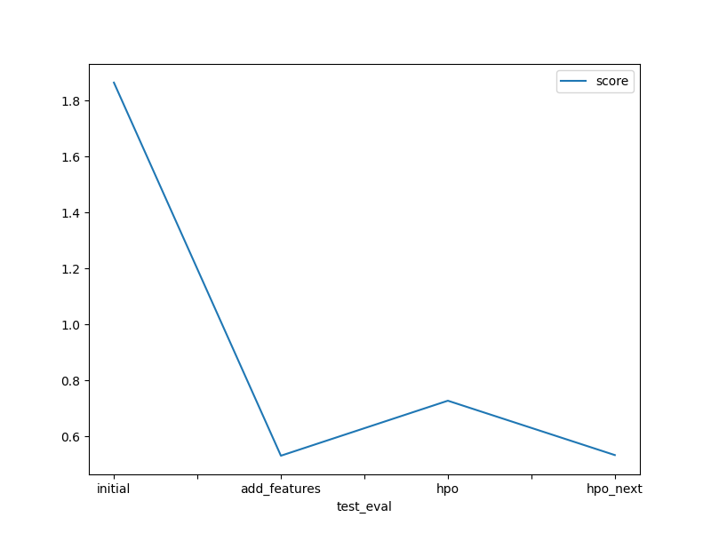

# Report: Predict Bike Sharing Demand with AutoGluon Solution
#### Daya Alex

## Initial Training
### What did you realize when you tried to submit your predictions? What changes were needed to the output of the predictor to submit your results?
- **Submission Realization:** Negative prediction values had to be clipped to zero as counts can't be negative. The train and test datasets needed to have the same columns for successful predictions, requiring the removal of 'casual' and 'registered' columns from the training data.

### What was the top ranked model that performed?
- **Initial Data:** KNeighborsDist and WeightedEnsemble_L2 with an RMSE of -92.452800.
- **Feature Engineered Data:** WeightedEnsemble_L2 with an RMSE of 32.362633.
- **Manual Hyperparameter Tuning:** RMSE of 47.594046.
- **Automated Hyperparameter Tuning:** RMSE of 34.702.
- **Best Overall:** WeightedEnsemble_L2 created using feature engineered data.

## Exploratory data analysis and feature creation
### What did the exploratory analysis find and how did you add additional features?
I could not find much from the EDA from just histogram viewing. I could see that train and test sets had similar histograms for their features except for 'day' which revealed that test set had days toward the end of the month, while the train set had days earlier in the month.

### How much better did your model preform after adding additional features and why do you think that is?
Splitting the datetime feature gave a huge boost in results, the datetime feauture in itself was not discriminative, but the model could find out patterns from the feature engineered values like 'hour','day'
'is_month_start', 'is_year_start'.

## Hyper parameter tuning
### How much better did your model preform after trying different hyper parameters?
It performed better than the initial model with no feature engineered data, but manual hyperparameter tuning was not giving competitive results, best results from hyperparameter tuning was achieved with the setting 'light' (to focus on simple less complex models) and 'auto' to leverage existing autogluon algorithms to fine tune hyperparameters according to the given data.

### If you were given more time with this dataset, where do you think you would spend more time?
Exploratory Data analysis to create more relevant features, try tweaking WeightedEnsemble model to get better score like run it longer.

### Create a table with the models you ran, the hyperparameters modified, and the kaggle score.
| model                                      | LightGBM/T2                                                                                                                                     | LightGBMLarge                                                                                                      | XGBoost/T7                                                                                                                                                                                                                                        |   score |
|:-------------------------------------------|:------------------------------------------------------------------------------------------------------------------------------------------------|:-------------------------------------------------------------------------------------------------------------------|:--------------------------------------------------------------------------------------------------------------------------------------------------------------------------------------------------------------------------------------------------|--------:|
| initial                                    | default                                                                                                                                         | default                                                                                                            | default                                                                                                                                                                                                                                           | 1.8     |
| add_features                               | default                                                                                                                                         | default                                                                                                            | default                                                                                                                                                                                                                                           | 0.53127 |
| best_hpo: with settings 'light' and 'auto' | {'learning_rate': 0.06994332504138305, 'feature_fraction': 0.8872033759818312, 'min_data_in_leaf': 5, 'num_leaves': 83, 'num_boost_round': 373} | {'learning_rate': 0.03, 'num_leaves': 128, 'feature_fraction': 0.9, 'min_data_in_leaf': 5, 'num_boost_round': 595} | {'learning_rate': 0.019449795636786765, 'n_jobs': -1, 'proc.max_category_levels': 100, 'objective': 'reg:squarederror', 'booster': 'gbtree', 'max_depth': 8, 'min_child_weight': 1, 'colsample_bytree': 0.8240859360255985, 'n_estimators': 2038} | 0.5338  |				

### Create a line plot showing the top model score for the three (or more) training runs during the project.

### Create a line plot showing the top kaggle score for the three (or more) prediction submissions during the project.

## Summary
I could learn many things by trying out this Kaggle competition using Autogluon. I could see that neural networks were not the front runners in regression task in tabular data and instead Weighted Ensemble methods were the stars. I understood the impact of feature engineering, how it is as important as hyperparmeter optimisation